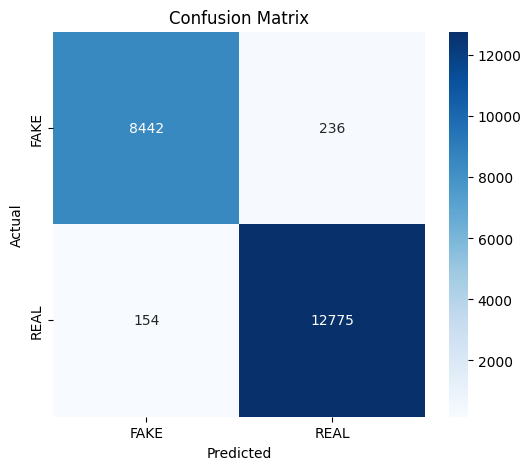
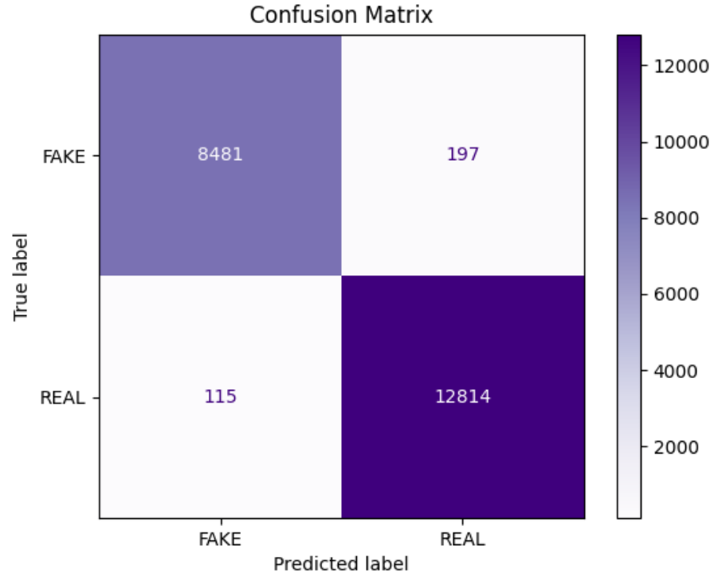
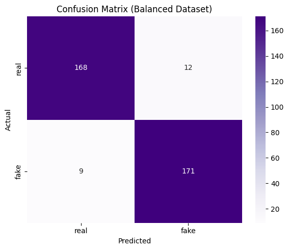

## Transformer Ensembles for Fake News Detection: A Multimodal Perspective with ViT, BERT, and DeBERTa ##

- This project aims to accurately detect and classify both fake and real news content, as well as distinguish between AI-generated and authentic (real) images

## Dataset Description ##

**RealFakeNews: A Dataset for Detecting Fake News**

RealFakeNews is a dataset of over **108,000** news samples designed for developing and evaluating models that detect misinformation. Each entry features a short news article and a label indicating whether it is **REAL** or **FAKE**.

---

## Dataset Overview

- **Total Samples:** 108,032  
- **Columns:**  
  - `text`: News content (`string`)
  - `label`: Classification label (`REAL` or `FAKE`)
- **Language:** English
- **Format:** CSV  
- **License:** [CC BY-NC-SA 4.0](https://creativecommons.org/licenses/by-nc-sa/4.0/)

---

## Label Distribution

| Label | Meaning    | Count   |
|-------|------------|---------|
| REAL  | Real News  | 64,641  |
| FAKE  | Fake News  | 43,391  |

> ⚠️ *Note: The dataset is slightly imbalanced, with more real news than fake news entries.*

---

## Use Cases

- Fake news classification
- NLP experiments on misinformation
- Training and fine-tuning transformers (e.g., BERT, RoBERTa)
- Evaluation using metrics like Accuracy, F1-score, ROC-AUC

---

## Sample Entry
{
  "text": "From India Censoring Internet Archive To No Night On Aug 12: Not Real....No! Banks are NOT charging Rs 150 after 4 transactions on...",
  "label": "FAKE"
}

---

## ⚠️ Warning

- **Misinformation Risk:** This dataset contains content labeled "FAKE" that may include false or misleading information. "REAL" entries are not guaranteed to be fully accurate or current.
- **Not for Automated Fact-Checking:** Models trained using this dataset **should not** be used for critical or real-world fact-checking without human oversight.
- **Potential Bias:** Despite including a range of sources, some bias in topics, language, or framing may exist.
- **Research & Educational Use Only:** Use is limited to non-commercial research/education. **Commercial use requires separate permission**.

> Use this dataset responsibly and with awareness of its limitations.

# Model Details #
- In Our project we used  a hybrid ensemble deep learning models—BERT, DeBERTa, and Vision Transformer to perform multimodal fake news detection. Specifically, the system classifies textual news content as real or fake, and distinguishes between AI-generated images and authentic real-world images.

**BERT (Text Classification)**

We fine-tuned the BERT model (bert-base-uncased) on news articles. We combined the article title and content into one text input. The model learns to classify each article as REAL or FAKE.

- Tokenizer: BERT tokenizer with truncation and padding
- Loss Function: Weighted CrossEntropyLoss
- Optimizer: AdamW (lr = 2e-5)
- Evaluation Metrics: Accuracy, F1-score, Precision, Recall

**DeBERTa (Text Classification)**

DeBERTa is another transformer model we used to improve text classification results. It works similarly to BERT but gives better performance on longer and more complex text.

- Tokenizer: DeBERTa tokenizer (max_length = 128)
- Training Enhancements: Gradient checkpointing, FP32 precision
- Evaluation Strategy: Validation every 500 steps using F1-score
- Saving Strategy: Best model checkpoint saved based on F1

**ViT for Image Classification**

To detect whether an image is AI-generated or real, we fine-tuned the model using image data. The dataset is structured into two categories (real and fake) and preprocessed using ViTImageProcessor.

 - Preprocessing: Pixel-level transformation using ViT’s image processor
 - Training Strategy: Mixed-precision training (torch.amp) with early stopping
 - Loss Function: CrossEntropyLoss
 - Optimizer: AdamW with ReduceLROnPlateau scheduleru.

## How It Works ##

A **BERT-based model** was fine-tuned on a labeled dataset of news articles.
- Input text was tokenized using BertTokenizer with truncation and padding.
- A custom Trainer with class-weighted loss was used to address class imbalance in the dataset.
- Outputs are binary: 0 = FAKE and 1 = REAL

A **DeBERTa model**was fine-tuned on labeled news text (REAL vs FAKE).
- Input text is tokenized using DebertaTokenizer with a max length of 128 tokens.
- The model uses FP32 precision and gradient checkpointing for memory efficiency.
- Training uses the Trainer API with dynamic padding, AdamW optimizer, and evaluation every 500 steps.
- Final predictions are binary:0 = FAKE and 1 = REAL

 A **Vision Transformer (ViT)** was fine-tuned on a labeled dataset of real and fake news images.
 - Images are preprocessed using ViTImageProcessor to match the model's input format.
 - A custom loader skips corrupt images to ensure smooth training.
 - Training uses mixed precision, AdamW optimizer, and early stopping for efficiency and stability.
 - The model outputs binary predictions:0 = FAKE and 1 = REAL

## Training Details ##

  - **Model**: *BertForSequenceClassification*
  - **Epochs**: 4
  - **Batch size**: 8
  - **Learning rate**: 2e-5
  - **Optimizer**: AdamW 
  - **Evaluation Metrics**: Accuracy, F1-score, Precision, Recall
---
  - **Model**: *DebertaForSequenceClassification*
  - **Epochs**: 3
  - **Batch size**: 2 (with gradient accumulation steps = 4)
  - **Learning rate**: 2e-5
  - **Optimizer**: AdamW (Trainer with adamw_torch)
  - **Evaluation Metrics**: Accuracy, F1-score, Precision, Recall
---
  - **Model**: *ViTForImageClassification*
  - **Epochs**: 10
  - **Batch size**: 16
  - **Learning rate**: 2e-5
  - **Optimizer**: AdamW
  - **Evaluation Metrics**: Accuracy, F1-score, Precision, Recall

## Results

We evaluated three models for binary fake news classification: **BERT**, **DeBERTa**, and a **Vision Transformer (ViT)** model. Below are their performance metrics on the respective test sets.

---

### BERT Results

- **Test Set Size**: 21,607 samples  
- **Accuracy**: 98%

| Class     | Precision | Recall | F1-Score |
|-----------|-----------|--------|----------|
| Fake News | 0.98      | 0.97   | 0.98     |
| Real News | 0.98      | 0.99   | 0.98     |
| **Macro Avg** | 0.98  | 0.98   | 0.98     |
| **Weighted Avg** | 0.98  | 0.98   | 0.98     |

- Consistently high scores show BERT’s robustness in identifying both fake and real news.

<!-- Optional ROC curve image -->

---

### DeBERTa Results

- **Test Set Size**: 21,607 samples  
- **Accuracy**: 99%

| Class     | Precision | Recall | F1-Score |
|-----------|-----------|--------|----------|
| Fake News | 0.99      | 0.98   | 0.98     |
| Real News | 0.98      | 0.99   | 0.99     |
| **Macro Avg** | 0.99  | 0.99   | 0.99     |
| **Weighted Avg** | 0.99  | 0.99   | 0.99     |

- DeBERTa demonstrates state-of-the-art performance with highly balanced metrics.

---

### ViT Results

- **Test Set Size**: 360 samples (balanced)  
- **Accuracy**: 94%

| Class     | Precision | Recall | F1-Score |
|-----------|-----------|--------|----------|
| Fake News | 0.93      | 0.95   | 0.94     |
| Real News | 0.95      | 0.93   | 0.94     |
| **Macro Avg** | 0.94  | 0.94   | 0.94     |
| **Weighted Avg** | 0.94  | 0.94   | 0.94     |

- Even with a smaller dataset, the ViT model exhibits strong and balanced performance.

---

### Summary

| Model     | Accuracy | Macro F1-Score |
|-----------|----------|----------------|
| BERT      | 98%      | 0.98           |
| DeBERTa   | 99%      | 0.99           |
| ViT       | 94%      | 0.94           |

> All models perform strongly in fake news detection. DeBERTa achieves the best overall performance. ViT holds promise, especially in multimodal or resource-constrained setups(also ViT can be used for detecting AI images only).

## 🛠 Libraries Used ##

 - transformers
 - datasets
 - torch
 - scikit-learn
 - pandas
 - nltk (optional preprocessing)

## 📦 Installation & Running ##

- pip install -r requirements.txt
- python app.py
- Or run the training script in a notebook or script environment if you're using Google Colab or Jupyter.

## ⚠️Disclaimer

 - This project is for educational and experimental purposes only.
 - It is not suitable for real-world fact-checking or serious decision-making.
 - The model uses a simple binary classifier and does not verify factual correctness.

## Project Overview
- This fake news classifier was built as part of a *research internship* to:
- Learn how to fine-tune transformer models on classification tasks
- Practice handling class imbalance using weighted loss
- Deploy models using Hugging Face-compatible APIs

**License:**  
[CC BY-NC-SA 4.0](https://creativecommons.org/licenses/by-nc-sa/4.0/)

